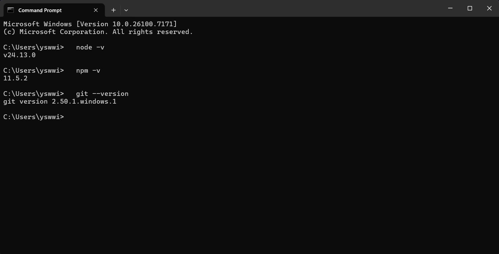
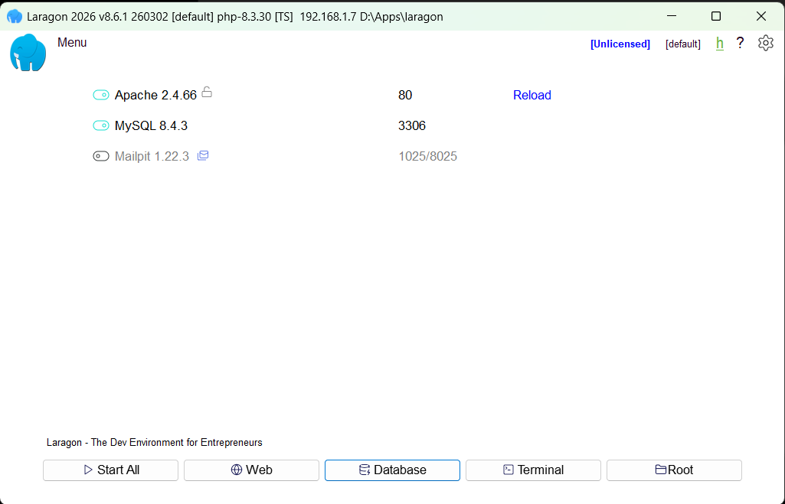
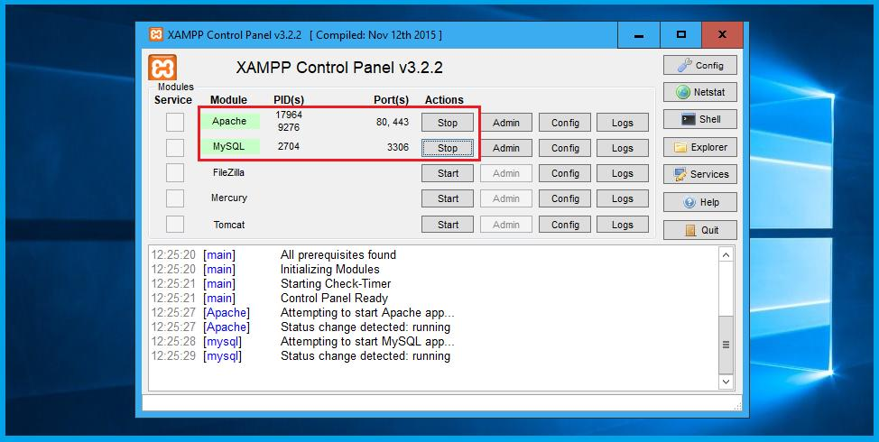

# 📌 Academy - Tugas 1: Persiapan Tools

Selamat datang di Academy!

Sebelum mengikuti materi Academy, **setiap peserta diwajibkan** untuk menginstall dan menyiapkan seluruh tools yang akan digunakan selama kegiatan berlangsung.

## 🛠️ Tools yang Harus Disiapkan

> **Windows**
>
> - Node.js (versi LTS direkomendasikan) – [Download Here!](https://nodejs.org/en/download/current)
> - Laragon – [Download Here!](https://laragon.org/download)
> - Git – [Download Here!](https://git-scm.com/install/windows)

> **macOS / Linux**
>
> - Node.js (versi LTS direkomendasikan) – [Download Here!](https://nodejs.org/en/download/current)
> - XAMPP – [Download Here!](https://www.apachefriends.org/download.html)
> - Git – [Download Here!](https://git-scm.com/downloads/mac)

> **Semua Peserta**
>
> - Akun GitHub – [Sign Up Here!](https://github.com/signup)
> - Akun Figma (menggunakan email Telkom University) – [Sign Up Here!](https://www.figma.com/signup)
> - Akun Notion – [Sign Up Here!](https://app.notion.com/signup)

## ✅ Verifikasi Instalasi

Pastikan seluruh tools telah berhasil diinstall.

Jalankan perintah berikut pada terminal:

```bash
node -v
npm -v
git --version
```

Pastikan juga Laragon dapat dijalankan dengan baik dan layanan **Apache** serta **MySQL** berada pada status **Running**.

---

## 📋 Checklist

- [ ] Node.js
- [ ] npm
- [ ] Laragon
- [ ] Git
- [ ] Akun GitHub
- [ ] Akun Figma (Email Telkom)
- [ ] Akun Notion

---

## Bukti Pengerjaan

Silakan unggah [**disini**](https://forms.gle/bBgavMJERnLwYNaDA):

1. Screenshot hasil menjalankan:

   ```bash
   node -v
   npm -v
   git --version
   ```

2. Screenshot:
   - **Windows:** Laragon dalam keadaan **Running**.
   - **macOS:** XAMPP dalam keadaan **Running**.

3. Link akun GitHub.
4. Link akun Figma.
5. Link akun Notion.

## 📷 Contoh Hasil yang Benar

### Terminal



### Windows (Laragon)



### macOS / Linux (XAMPP)


